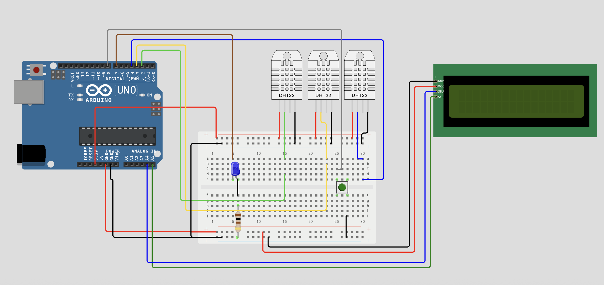

# Heat Exporter

A lightweight Arduino-based telemetry exporter for home heating systems.  
The project reads multiple temperature sensors, displays values on an LCD, and exposes them via a simple HTTP endpoint for external monitoring (e.g., Prometheus).

---

## 📌 Features

- Reads **a set of DHT22/DHT11 temperature sensors**
- Displays live readings on **1602 I²C LCD**
- Serves metrics over WiFi (Prometheus-style text output)
- Includes **mode button** and **status LED**
- Includes full **Wokwi hardware schema**
- Full wiring diagram **embedded below as PNG**

---

## 🧩 Hardware Overview

| Component | Quantity | Notes |
|----------|----------|-------|
| Arduino Uno R4 WiFi| 1 | Main MCU |
| DHT22/DHT11 Temperature Sensors | 3+ | Connected to pins D2, D3, D4, D6, D7 |
| LCD 1602 (I2C) | 1 | SDA → A4, SCL → A5 |
| Push Button | 1 | Mode button on D8 |
| Blue LED + 100Ω resistor | 1 | Status LED on D7 |
| Breadboard | 1 | Wiring surface |

---

## 🔌 Wiring Diagram (Embedded PNG)

The following diagram shows the recommended wiring layout.  
It corresponds exactly to the Wokwi JSON schema.

###  Wiring Image



 


---

## 🧪 Wokwi Simulation


### **Wokwi Hardware JSON**

```json
{
  "version": 1,
  "author": "Andris Zbitkovskis",
  "editor": "wokwi",
  "parts": [
    { "type": "wokwi-breadboard-half", "id": "bb1", "top": 352.2, "left": -275.6 },
    { "type": "wokwi-arduino-uno", "id": "uno", "top": 96.6, "left": -624.6 },
    { "type": "wokwi-dht22", "id": "dht1", "top": 201.9, "left": -5.4, "attrs": { "temperature": "24.6" } },
    { "type": "wokwi-dht22", "id": "dht2", "top": 201.9, "left": -72.6, "attrs": { "temperature": "23.6" } },
    { "type": "wokwi-dht22", "id": "dht3", "top": 201.9, "left": -139.8, "attrs": { "temperature": "34.3" } },
    { "type": "wokwi-lcd1602", "id": "lcd2", "top": 227.2, "left": 159.2, "attrs": { "pins": "i2c" } },
    { "type": "wokwi-pushbutton-6mm", "id": "btn1", "top": 443.1, "left": -24.3, "rotate": 90,
      "attrs": { "color": "green", "xray": "1" } },
    { "type": "wokwi-led", "id": "led1", "top": 399.6, "left": -226.6, "attrs": { "color": "blue" } },
    { "type": "wokwi-resistor", "id": "r1", "top": 513.6, "left": -230.95, "rotate": 90, "attrs": { "value": "100" } }
  ],
  "connections": [
    ["bb1:tp.1", "uno:3.3V", "red"],
    ["dht3:VCC", "bb1:tp.11", "red"],
    ["dht3:GND", "bb1:tn.14", "black"],
    ["dht1:GND", "bb1:tn.25", "black"],
    ["dht2:SDA", "bb1:23t.a", "gold"],
    ["dht1:SDA", "bb1:30t.a", "blue"],
    ["bb1:23t.b", "uno:3", "gold"],
    ["uno:4", "bb1:30t.e", "blue"],
    ["dht3:SDA", "bb1:15t.a", "cyan"],
    ["bb1:15t.d", "uno:2", "cyan"],
    ["dht2:VCC", "bb1:tp.17", "red"],
    ["dht2:GND", "bb1:tn.20", "black"],
    ["bb1:bp.1", "uno:GND.2", "red"],
    ["uno:GND.3", "bb1:bn.1", "black"],
    ["bb1:bn.10", "lcd2:GND", "black"],
    ["bb1:bp.9", "lcd2:VCC", "red"],
    ["uno:A5", "lcd2:SCL", "green"],
    ["uno:A4", "lcd2:SDA", "blue"],
    ["uno:GND.1", "bb1:tn.2", "black"],
    ["dht1:VCC", "bb1:tp.23", "red"],
    ["bb1:bn.22", "bb1:27b.j", "black"],
    ["bb1:25t.c", "uno:8", "gray"],
    ["r1:1", "bb1:6b.h"],
    ["r1:2", "bb1:bn.5"],
    ["led1:A", "bb1:6t.e"],
    ["led1:C", "bb1:5t.e"],
    ["uno:7", "bb1:5t.a", "#8f4814"]
  ]
}
```
## 🛠 Installation & Build

### 1. Clone the repository

```bash
git clone https://github.com/zbitmanis/heat-exporter.git
cd heat-exporter
```

### 2. Configure WiFi credentials
Create a file named secrets.h in the project root:

```cpp 
#pragma once
#define WIFI_SSID "your-wifi-ssid"
#define WIFI_PASS "your-wifi-password"
```

### 3. Install Arduino dependencies

In the Arduino IDE, install the following libraries:

1. DHT sensor library (Adafruit)
1. Adafruit Unified Sensor
1. LiquidCrystal_I2C
1. WiFiNINA (or your board’s WiFi library)

## 📟 Accessing Metrics

Once the board connects to WiFi, find its IP address over Serial Monitor and run:

``` bash
curl http://<device-ip>/metrics

```
Example output: 

```nginx
# HELP boiler_flow_temperature Temperatures of the flow in degree celsius.
# TYPE boiler_flow_temperature gauge
boiler_flow_temperature{sensor="boiler_out"} 21.00
boiler_flow_temperature{sensor="floor_in"} 21.20
boiler_flow_temperature{sensor="floor_out"} 21.20
```

